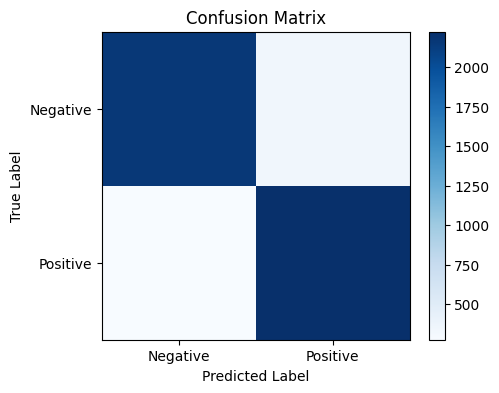

# Sentiment Analysis on IMDB Movie Reviews

Classifies movie reviews as positive or negative using TF-IDF vectorization and Logistic Regression, trained on the real IMDB Large Movie Review Dataset (50,000 reviews).

## Overview
- Downloads and extracts the Stanford IMDB dataset automatically (25,000 train / 25,000 test reviews)
- Vectorizes review text using TF-IDF with unigrams and bigrams, English stop-word removal
- Trains a Logistic Regression classifier on 20,000 samples, validates on 5,000
- Evaluates with accuracy, a full classification report, and a confusion matrix

## Results
- **Validation Accuracy:** 87.74%

| Class | Precision | Recall | F1-Score | Support |
|---|---|---|---|---|
| Negative | 0.89 | 0.86 | 0.88 | 2500 |
| Positive | 0.87 | 0.89 | 0.88 | 2500 |
| **Accuracy** | | | **0.88** | 5000 |



## Key Insight
The model performs strongly and evenly across both classes (F1 of 0.88 for both), showing balanced performance — it doesn't favor detecting one sentiment over the other, which is exactly what you want on a class-balanced dataset like this one.

## Tech Stack
Python, Scikit-learn, NumPy, Matplotlib, Requests, tqdm

## How to Run
```bash
pip install -r requirements.txt
python sentiment_analysis.py
```
Note: the first run downloads the IMDB dataset (~80MB) and extracts 50,000 text files, so it may take a few minutes.

## Dataset
[IMDB Large Movie Review Dataset](https://ai.stanford.edu/~amaas/data/sentiment/) — Maas et al., Stanford AI Lab

## Future Improvements
- Compare against other models (Naive Bayes, SVM, or a fine-tuned transformer like BERT)
- Try word embeddings (Word2Vec, GloVe) instead of TF-IDF
- Deploy as an interactive Streamlit demo for live sentiment predictions